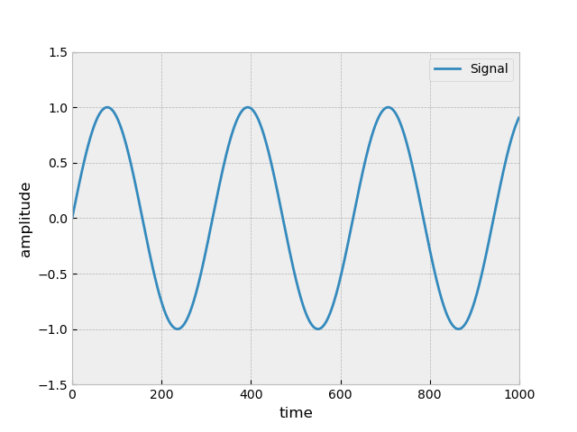
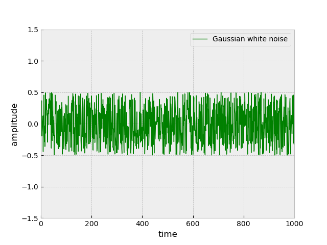
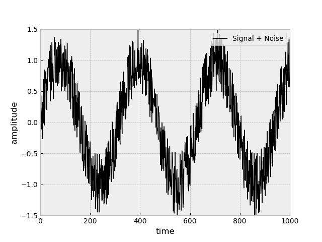
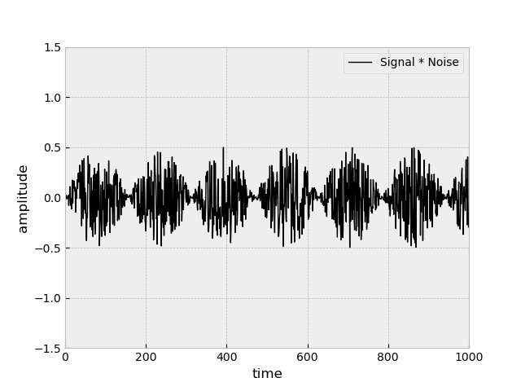
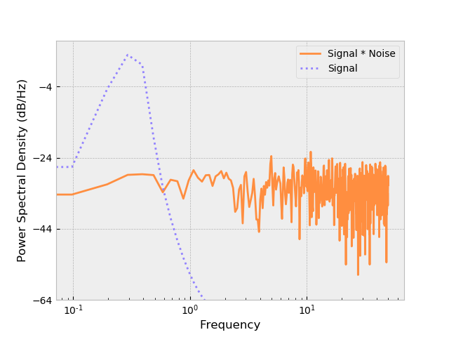
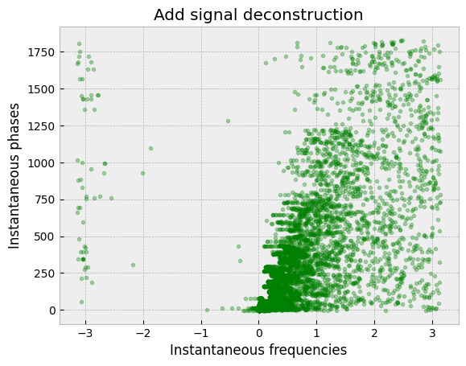
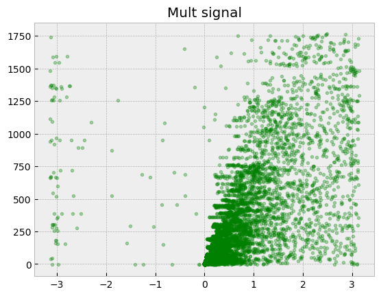

# Holo-Hilbert spectral analysis
[Paper: DOI: 10.1098/rsta.2015.0206](https://www.researchgate.net/publication/297661784_On_Holo-Hilbert_spectral_analysis_a_full_informational_spectral_representation_for_nonlinear_and_non-stationary_data) 

## How to use
Run `Holo-Hilbert-SA.ipynb` code. 

## Showcase

We have two signals one is sine wave, another just white noise.  
We can add them together or multiply them.  
   

After addition we can still see sine wave, but after multiplication it's not so clear but we still can guess sine pattern.  
 

We can see how the Fourier transform (FFT) to cope with the transformation of these signals.
We will use power spectral density (PSD) for it, computation of PSD is done directly by FFT. PSD shows at which frequencies variations are strong and at which frequencies variations are weak.  
We can clearly see sine wave for additive signal, but for multiplicative original sine wave complitly gone.  
 

After applying HHSA transform we can get next date represenration for signal, that is actually 3D. We collapse it alonge the time axis. Here Y axis should be ampletude and X axis frequency, but I not rely sure how to interprete those values myself.
 
 


## Requirements
Install requerements with a command:
```
pip install numpy matplotlib scipy tqdm
```

## TODO
- [x] Figure out the Figure4b (HSA)
- [x] Figure out FM/AM, Figure6c (kinda)
- [x] EMD ([paper](https://www.researchgate.net/publication/221534245_Empirical_Mode_Decomposition_-_an_introduction))

---
If you have any suggestions leave a pull request or an issue.
Thank you.
